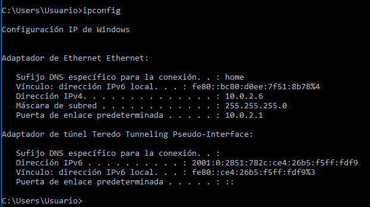
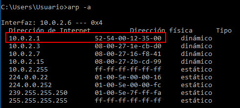

## Medidas de protección:
## Detección de ataque MITM (ARP poisoning) con Snort

https://youtu.be/BAoMqWdkUPo

### ¿Qué es un ataque MIMT?

Un ataque **Man in the Middle** o ataque de intermediario es un tipo de ataque destinado a interceptar, sin autorización, la comunicación entre dos dispositivos (hosts) conectados a una red.

Este ataque le permite al ciberdelincuente manipular el tráfico interceptado de diferentes formas, ya sea para escuchar la comunicación y obtener información sensible, como credenciales de acceso, información financiera, etc., o para suplantar la identidad de alguna de las partes.

Para que un ataque MITM funcione correctamente, el ciberdelincuente debe asegurarse que será el único punto de comunicación entre los dos dispositivos, es decir, el ciberdelincuente debe estar presente en la misma red que los hosts apuntados en el ataque para cambiar la tabla de enrutamiento para cada uno de ellos.

### Características principales de un ataque MITM

- El ataque se realiza sobre la transmisión de tráfico o datos entre dos partes, ya sean dos usuarios, o un usuario y un servidor.
- El atacante actúa como intermediario en la comunicación, suplantando la identidad de una de las partes (o de ambas), de forma que los datos siempre pasan por él antes de ser enviados a la otra parte.
- Aunque la información entre ambos host viaje cifrada, el ciberdelincuente puede descifrarla antes de transmitirla a la otra parte.
- Quienes realizan la comunicación no saben que están siendo objeto de este ataque, y creen que se están comunicando entre ellos de forma normal.
- Estos ataques son muy peligrosos y difíciles de detectar.
- El ciberdelincuente puede decidir si el mensaje interceptado continuará, si lo hará con la misma información o si lo hará con otro contenido modificado que pudiera suponerle una ventaja o beneficio.

### Tipos de ataques

Los ataques MITM tienen diferentes modalidades que dependen de la técnica empleada:

- Puntos de acceso wifi abiertos o con baja seguridad

Los puntos de acceso wifi públicos o con bajo nivel de seguridad pueden suponer un riesgo en el que un atacante de forma deliberada permite la conexión para poder efectuar un ataque de “Man in the middle”.

Otra modalidad consiste en imitar el nombre de una red cercana (SSID) para crear confusión y que algunas personas conecten por error a ella, además muchos dispositivos están configurados por defecto para conectar sin preguntar, conectándose automáticamente a las redes abiertas más cercanas o cuyo nombre SSID es igual.

- Redes locales (LAN)

Las redes locales (Local Area Network LAN) de las empresas también son vulnerables a este tipo de ataques.

El atacante deberá tener acceso a la red local corporativa, donde podrá lanzar un ataque que consistirá en engañar a los equipos de la red local haciéndoles creer que es un dispositivo legítimo de la misma y forzando a que todo el tráfico generado pase a través del dispositivo controlado por el ciberdelincuente.

El acceso a las redes locales puede ser llevado a cabo de forma física, por ejemplo con un ordenador o mediante malware, infectando por ejemplo determinados servidores y pudiendo manipular sus respuestas.

- Software de navegación anticuado.

Por otro lado, los atacantes también aprovechan las vulnerabilidades de los navegadores obsoletos o no actualizados, por lo que debemos prestar especial atención.

## Como realizar un ataque MITM.

En mi caso, tengo 3 equipos conectados a la misma red.
La primera maquina será Kali linux, con la cual realizaremos el ataque y las otras dos maquinas, serán windows 10. Una hará de router y la otra será el cliente.

Lo primero que haremos es mirar la configuracion IP de las máquinas:

**IP MAQUINA KALI**

**IP MAQUINA WINDOWS 10 (Router)**

**IP MAQUINA WINDOWS 10 (Cliente)**

Lo siguiente que haremos es mirar las tablas de ARP de las dos maquinas Windows.
Es importante fijarse en la mascara de la puerta de enlace (IP 10.0.2.1), ya que cuando realicemos el ataque, veremos que cambia a la mascara de la maquina kali (maquina con la cual hemos realizado el ataque).

**Tabla ARP WINDOWS 10 (Router)**

**Tabla ARP WINDOWS 10 (Router)**

Una vez hemos comprobado las tablas de ARP de las maquinas windows, vamos a Kali y realizamos el ataque con la herramienta grafica **Ettercap**.

La herramienta **Ettercap** se encuentra en **Aplicaciones > 09 - Sniffing & Spoofing > etthercap-grafical**.

Seleccionamos **Sniffing at startup** y la interfaz primaria. En mi caso la **eth0**.

Cuando estemos dentro, debemos darle a la lupa que aparece arriba a la izquierda para escanear los equipos que se encuentran en la misma red. Cuando se haya realizado el escaneo, seleccionamos el icono que se encuentra a la derecha de la lupa para que nos muestre el listado de equipos.

Como vemos, aparecen las IPs de los equipos.

Lo mas importante a tener en cuenta son los target:
- Target 1: IP del dispositivo que queremos monitorizar.
- Target 2: IP del dispositivo que queremos suplantar. En nuestro caso será la IP de la puerta de enlace.

Ahora, seleccionamos los 2 equipos y lo añadimos al **Target 1**.

Seleccionamos la IP de la puerta de enlace (10.0.2.1) y la añadimos al **Target 2**

Resultado de añadir los equipos a los Target:

Por ultimo, para lanzar el ataque, nos iremos a la bola del mundo que aparece en la parte superior derecha (MITM menu) y seleccionamos **ARP poisoning** y nos aseguramos que esté marcada la opcion **Sniff remote connections**.

El ataque realiza envenenamiento ARP a las victimas:

Una vez hayamos realizado el ataque, si volvemos a revisar las tablas ARP de las maquinas windows, podremos observar que la direccion MAC de la puerta de enlace ha cambiado, siendo ahora la MAC de la maquina Kali.

## Como protegernos de los accesos no autorizados al equipo con SNORT.

### ¿Que es Snort?
SNORT es un sistema de detección de intrusos basado en red que está escrito en lenguaje de programación C. Fue desarrollado en 1998 por Martin Roesch. Ahora está desarrollado por Cisco.

Es un software gratuito de código abierto. También se puede utilizar como rastreador de paquetes para monitorizar el sistema en tiempo real. El administrador de la red puede usarlo para observar todos los paquetes entrantes y encontrar los que son peligrosos para el sistema.

Se basa en la herramienta de captura de paquetes de la biblioteca. Las reglas son bastante fáciles de crear e implementar y se pueden implementar en cualquier tipo de sistema operativo y cualquier tipo de entorno de red. La principal razón de la popularidad de este IDS sobre otros es que es un software de uso gratuito y también de código abierto, por lo que cualquier usuario puede usarlo de la manera que desee.

Snort se basa en libpcap (para la captura de paquetes de la biblioteca), una herramienta que se utiliza ampliamente en analizadores y rastreadores de tráfico TCP / IP. A través del análisis de protocolos y la búsqueda y comparación de contenido, Snort detecta métodos de ataque, incluida la denegación de servicio, el desbordamiento del búfer, los ataques CGI, los escaneos de puertos sigilosos y las sondas SMB. Cuando se detecta un comportamiento sospechoso, Snort envía una alerta en tiempo real a syslog, un archivo de ‘alertas’ separado o a una ventana emergente.

### ¿Para qué sirve y cómo funciona?
Snort es un sistema de detección de intrusiones en la red, pero viene con tres modos de operación, todos los cuales son parte del NIDS en sí mismo. El primer modo, Sniffer Mode, muestra los paquetes que transitan por la red. Puede configurarse para mostrar varios tipos de paquetes (TCP, UDP, ICMP), así como qué mostrar de los paquetes en sí, ya sea los encabezados o los datos del paquete.

El segundo modo de operación otorgado por snort es el Packet Logger Mode. Permite al usuario guardar los paquetes detectados en el modo Sniffer para guardarlos en el disco duro. A través de este modo, el usuario puede especificar reglas que indiquen qué paquetes guardar, por ejemplo, para guardar solo los paquetes relativos a una dirección específica.

Finalmente, el último modo es el modo NIDS. Este modo es muy similar al registrador de paquetes, pero permite que se apliquen reglas más específicas a los paquetes, refinando los paquetes que de hecho se registran (o alertan). Las reglas aplicadas se especifican o se incluyen en el archivo de configuración que se pasa como parámetro al iniciar snort.

Cabe señalar que cada uno de estos modos tiene varias opciones que se pueden configurar a través de parámetros de línea de comando o incluso archivos de configuración.

Por ejemplo, con las alertas activadas en modo NIDS, puedes configurar el contenido de las alertas, dónde se almacenan las alertas, o incluso si solo deseas enviarlas a la consola, o a través de un socket UNIX a otro programa. Si bien la entrada para el NIDS se realiza normalmente con el modo Sniffer, esto se puede reemplazar con un archivo .pcap (captura de paquetes) si el rastreo no es una opción.

### Características principales
Estas son las principales características de Snort:

- Monitor de tráfico en tiempo real
- Registro de paquetes
- Análisis de protocolo
- Coincidencia de contenido
- Huellas digitales del SO
- Puede instalarse en cualquier entorno de red.
- Crea registros
- Fuente abierta
- Las reglas son fáciles de implementar

Snort funciona en Windows y en Linux.

### Componentes de Snort
Snort se compone de cuatro componentes principales, que encadenados permiten que cumpla con sus diversos modos.

El primer componente es el decodificador, que se encarga de formar paquetes para ser utilizados por los demás componentes. Tiene la función de determinar qué protocolos subyacentes se utilizan en el paquete, así como de determinar la ubicación y el tamaño de los datos del paquete que luego se utilizan en componentes posteriores. Cabe señalar que el decodificador también busca anomalías en los encabezados, lo que puede hacer que genere alertas.

Los siguientes componentes principales son los preprocesadores. Estos componentes funcionan como complementos y pueden organizar o modificar paquetes de datos. Esto permite que los servicios (como HTTP o FTP) tengan un preprocesador correspondiente para verificar anomalías específicas de ese servicio. Su trabajo es, en última instancia, intentar hacer más difícil engañar al motor de detección. Ejemplos de cómo puede hacer esto son decodificando URI’s, desfragmentando paquetes, detectando escaneo de puertos, así como también detectando anomalías en paquetes ARP, como la suplantación de ARP.

El componente principal, el motor de detección, tiene la responsabilidad de detectar si existe alguna actividad de intrusión en un paquete. Para ello, encadena conjuntos de reglas, especificadas en archivos de configuración que incluyen estas reglas, y las aplica a cada paquete. Si el paquete coincide con una regla, se toma la acción especificada de esa regla o se descarta el paquete.

Si un paquete coincide con una regla, el sistema de alerta y registro generará la alerta. Por supuesto, el mensaje y los contenidos generados por este componente se pueden configurar a través del archivo de configuración. Si un paquete activa varias reglas, el nivel de alerta más alto es lo que realmente generará este componente.

Finalmente, después de que se genera una alerta o registro, pasa por el componente Módulos de salida. Este componente tiene la tarea de controlar el tipo de salida generada, utiliza un sistema de complementos que le da flexibilidad al usuario y también es altamente configurable. Esto puede incluir simplemente el registro en una base de datos, el envío de trampas SNMP, la generación de informes XML o incluso el envío de alertas a través de sockets UNIX, lo que permite la modificación dinámica de las configuraciones de red (firewalls o enrutadores).

### Reglas Snort
Como se mencionó anteriormente, las reglas se utilizan en todos los componentes para detectar anomalías en los paquetes. Las reglas se pueden aplicar a los encabezados de la capa de red y transporte (IP, TCP, UDP, ICMP) o incluso a los encabezados de la capa de aplicación (FTP, HTTP, etc.), pero por supuesto, las reglas también se pueden aplicar a los paquetes de datos.

Las reglas se componen de dos partes, un encabezado de regla, que especifica qué acción se debe tomar en caso de una coincidencia, el tipo de paquete (TCP, UDP, etc.), así como las direcciones IP de origen y destino y los números de puerto. La última parte son las Opciones de regla, que especifica el contenido que marca los paquetes como una coincidencia, la regla general tomará la siguiente forma:

action protocol source port -> destination port (options)

Cabe señalar que, si bien la mayoría de las opciones son opcionales, el sid (Snort ID) es obligatorio y no debe entrar en conflicto con el SID de otra regla. Es el identificador único que se le da a cada regla. Snort reserva SID de 0 a 1.000.000.

En las opciones de reglas, entre una larga lista de posibles indicadores que pueden usarse para detectar varios bits de datos en paquetes, los usuarios pueden incluir Expresiones regulares compatibles con Pearl a través de la opción pcre. Esto permite la detección de datos en el paquete mediante el uso de expresiones regulares, dando a las reglas más control y flexibilidad. PCRE toma el formato estándar, aunque deben escaparse las comillas dobles, el punto y coma y las barras diagonales./expression/flags

## Instalar y configurar SNORT en Ubuntu.

### Instalar SNORT
Nos vamos a la terminal de Ubuntu e instalamos **snort**:
> sudo apt-get install snort

### Configurar SNORT
Configuramos intervalo de direcciones para la red local. Configuramos la red en la que estamos.

Modificamos el archivo de configuracion **snort.conf** el cual se encuentra en **/etc/snort**.

- Indicar la red que queremos monitorizar.
> ipvar HOME_NET 10.0.2.0/24

- Configuramos reglas ARP spoof detection
> preprocessor arpspoof: -unicast
> preprocessor arpspoof_detect_host: <IP> <MASCARA>

Sustituimos <IP> y <MASCARA> por la IP y la MASCARA del equipo que queremos proteger.

- Comprobamos que la configuracion está perfecta desde la terminal.
> sudo snort -T -i <interfaz> -c /etc/snort/snort.conf

Si todo está perfecto, mostrara al final de la comprobacion un mensaje indicandolo.
> Snort successfully validated the configuration!
> Snort exiting

## Instalar y configurar ArpOn en Ubuntu.

### ¿Que es ArpOn?
ArpON ( inspección del controlador ARP ) es una solución basada en host que hace que el protocolo estandarizado ARP sea seguro para evitar el ataque Man In The Middle (MITM) a través de la suplantación de identidad ARP, el envenenamiento de caché ARP o el ataque de enrutamiento de envenenamiento ARP.

### Tipos de técnicas de suplantación de identidad anti ARP
1. SARPI ( Static ARP Inspection ) para las redes configuradas estáticamente sin DHCP;
2. DARPI ( Inspección ARP Dinámica ) para las redes configuradas dinámicamente con DHCP;
3. HARPI ( Inspección ARP Híbrida ) para las redes configuradas estática y dinámicamente con DHCP.

### Objetivo de ArpOn
El objetivo de ArpON es proporcionar un demonio de red seguro y eficiente que proporcione la técnica de suplantación de identidad anti ARP SARPI , DARPI y HARPI , lo que hace que el protocolo estandarizado ARP sea seguro contra cualquier intrusión externa.

### Características
Las características de ArpON son:
- Gratis _ ArpON se publica bajo la licencia de código abierto BSD . Esto significa que tienes total libertad para modificarlo y usarlo con tu sistema, incluso si es comercial.

- populares _ Muchos usuarios utilizan ArpON como demonio de la red, tanto los administradores de la red como los investigadores académicos. ArpON se descarga varios cientos de veces cada mes.

- Probado y confiable . Muchos usuarios han contribuido a lo largo de los años en la prueba de ArpON en una amplia gama de herramientas de ataque Man In The Middle (MITM) a través de la suplantación de identidad de ARP, el envenenamiento de caché de ARP o el enrutamiento de envenenamiento de ARP.

- Fácil de usar ArpON se distribuye como un tarball único que, una vez compilado, se ejecuta en todos los sistemas operativos compatibles . Ejecuta el ejecutable y, desde ese momento, el sistema operativo puede evitar el ataque Man In The Middle (MITM) a través de la suplantación de identidad de ARP, el envenenamiento de caché de ARP o el enrutamiento de envenenamiento de ARP.

- Multiplataforma . Muchos desarrolladores han contribuido a lo largo de los años en la migración de ArpON a una amplia gama de distribuciones GNU/Linux.

- Compatible y portátil . ArpON es completamente compatible con el protocolo estandarizado ARP . ArpON es un demonio de red que se ejecuta en el espacio del usuario, esto también significa que ArpON será fácilmente portátil a otros sistemas operativos.

- Bien documentado . La documentación de ArpON es fácil y completa. La documentación contiene el tutorial de recuperación ; el tutorial de construcción ; el tutorial de instalación ; el tutorial de usuario con muchos ejemplos y escenarios ; el tutorial de desarrollo con los Diagramas de Actividad de la técnica de spoofing anti ARP SARPI , DARPI y HARPI y con código fuente modular bien comentado; el tutorial de informe de erroresque lo lleva paso a paso a través de todas las funciones de ArpON.

### Instalar ArpOn
Nos vamos a la terminal de Ubuntu, actualizamos primeramente todos los paquetes e instalamos **arpon**:

> sudo apt-get install arpon

### Configurar ArpOn

Lo primero que debemos de comprobar es la tabla arp que tenemos. Para ello, ejecutamos el comando **arp -a**:
> guillevr@guillevrMV:~$ arp -a
> ? (10.0.2.3) en 08:00:27:63:65:1b [ether] en enp0s3
> ? (10.0.2.15) en 08:00:27:79:8b:1e [ether] en enp0s3
> _gateway (10.0.2.1) en 52:54:00:12:35:00 [ether] en enp0s3

Copiamos la direccion IP del router y su MAC. En mi caso es:
> 10.0.2.1 52:54:00:12:35:00

Modificamos el archivo de configuracion que se encuentra en **/etc/arpon.conf** y añadimos la direccion IP del router y la MAC que hemos copiado anteriormente:
> guillevr@guillevrMV:~$ sudo nano /etc/arpon.conf
> [sudo] contraseña para guillevr:
> guillevr@guillevrMV:~$
> guillevr@guillevrMV:~$ cat /etc/arpon.conf
> #
> # ArpON configuration file.
> #
> # See the arpon(8) man page for details.
> # Static entries matching the eth0 network interface:
> # First static entry:
> 10.0.2.1	52:54:00:12:35:00

Ejecutamos el demonio de Arp:
> guillevr@guillevrMV:~$ sudo arpon -d -i enp0s3 -H

Podemos visualizar lo que para a traves del fichero log que se encuentra en **/var/log/arpon/arpon.log**:
> guillevr@guillevrMV:~$ sudo tail -f /var/log/arpon/arpon.log
> [sudo] contraseña para guillevr:
> Mar 25 00:07:37 [INFO] Background process is running (4653).
> Mar 25 00:07:37 [INFO] Start HARPI on enp0s3
> Mar 25 00:07:37 [INFO] CLEAN, 10.0.2.3 was at 08:00:27:63:65:1b on enp0s3
> Mar 25 00:07:37 [INFO] CLEAN, 10.0.2.15 was at 08:00:27:79:8b:1e on enp0s3
> Mar 25 00:07:37 [INFO] CLEAN, 10.0.2.1 was at 52:54:00:12:35:00 on enp0s3
> Mar 25 00:07:37 [INFO] UPDATE, 10.0.2.1 is at 52:54:0:12:35:0 on enp0s3

Lo siguiente es irnos a la maquina Kali para realizar el ataque y comprobar que ArpOn realiza su trabajo correctamente.

Si volvemos a realizar un **arp -a** para refrescar la tabla ARP, podremos observar que no ha cambiado, es mas, en la interfaz se añade un **'PERM'**.

> guillevr@guillevrMV:~$ arp -a
> ? (10.0.2.3) en 08:00:27:63:65:1b [ether] en enp0s3
> ? (10.0.2.15) en 08:00:27:79:8b:1e [ether] en enp0s3
> _gateway (10.0.2.1) en 52:54:00:12:35:00 [ether] PERM en enp0s3

Y en el fichero log, podremos observar el trafico.
> guillevr@guillevrMV:~$ sudo tail -f /var/log/arpon/arpon.log
guillevr@guillevrMV:~$ sudo tail -f /var/log/arpon/arpon.log
> [sudo] contraseña para guillevr: 
> Mar 25 00:07:37 [INFO] Background process is running (4653).
> Mar 25 00:07:37 [INFO] Start HARPI on enp0s3
> Mar 25 00:07:37 [INFO] CLEAN, 10.0.2.3 was at 08:00:27:63:65:1b on enp0s3
> Mar 25 00:07:37 [INFO] CLEAN, 10.0.2.15 was at 08:00:27:79:8b:1e on enp0s3
> Mar 25 00:07:37 [INFO] CLEAN, 10.0.2.1 was at 52:54:00:12:35:00 on enp0s3
> Mar 25 00:07:37 [INFO] UPDATE, 10.0.2.1 is at 52:54:0:12:35:0 on enp0s3
> Mar 25 00:08:18 [INFO] REFRESH, 10.0.2.1 is at 52:54:0:12:35:0 on enp0s3
> Mar 25 00:08:19 [INFO] REFRESH, 10.0.2.1 is at 52:54:0:12:35:0 on enp0s3
> Mar 25 00:08:21 [INFO] REFRESH, 10.0.2.1 is at 52:54:0:12:35:0 on enp0s3
> Mar 25 00:08:22 [INFO] REFRESH, 10.0.2.1 is at 52:54:0:12:35:0 on enp0s3
> Mar 25 00:08:23 [INFO] REFRESH, 10.0.2.1 is at 52:54:0:12:35:0 on enp0s3
> Mar 25 00:08:33 [INFO] REFRESH, 10.0.2.1 is at 52:54:0:12:35:0 on enp0s3
> Mar 25 00:08:41 [INFO] DENY, 10.0.2.15 was at 8:0:27:79:8b:1e on enp0s3
> Mar 25 00:08:41 [INFO] ALLOW, 10.0.2.15 is at 8:0:27:79:8b:1e on enp0s3
> Mar 25 00:08:42 [INFO] DENY, 10.0.2.15 was at 8:0:27:79:8b:1e on enp0s3
> Mar 25 00:08:42 [INFO] ALLOW, 10.0.2.15 is at 8:0:27:79:8b:1e on enp0s3
> Mar 25 00:08:43 [INFO] REFRESH, 10.0.2.1 is at 52:54:0:12:35:0 on enp0s3
> Mar 25 00:08:43 [INFO] DENY, 10.0.2.15 was at 8:0:27:79:8b:1e on enp0s3
> Mar 25 00:08:43 [INFO] ALLOW, 10.0.2.15 is at 8:0:27:79:8b:1e on enp0s3
> Mar 25 00:08:53 [INFO] REFRESH, 10.0.2.1 is at 52:54:0:12:35:0 on enp0s3
> Mar 25 00:08:55 [INFO] DENY, 10.0.2.15 was at 8:0:27:79:8b:1e on enp0s3
> Mar 25 00:08:55 [INFO] ALLOW, 10.0.2.15 is at 8:0:27:79:8b:1e on enp0s3
> Mar 25 00:09:01 [INFO] DENY, 10.0.2.15 was at 8:0:27:79:8b:1e on enp0s3
> Mar 25 00:09:01 [INFO] ALLOW, 10.0.2.15 is at 8:0:27:79:8b:1e on enp0s3
> Mar 25 00:09:02 [INFO] DENY, 10.0.2.15 was at 8:0:27:79:8b:1e on enp0s3
> Mar 25 00:09:02 [INFO] ALLOW, 10.0.2.15 is at 8:0:27:79:8b:1e on enp0s3
> Mar 25 00:09:03 [INFO] REFRESH, 10.0.2.1 is at 52:54:0:12:35:0 on enp0s3
> Mar 25 00:09:03 [INFO] DENY, 10.0.2.15 was at 8:0:27:79:8b:1e on enp0s3
> Mar 25 00:09:03 [INFO] ALLOW, 10.0.2.15 is at 8:0:27:79:8b:1e on enp0s3
> Mar 25 00:09:13 [INFO] REFRESH, 10.0.2.1 is at 52:54:0:12:35:0 on enp0s3
> Mar 25 00:09:23 [INFO] REFRESH, 10.0.2.1 is at 52:54:0:12:35:0 on enp0s3
> Mar 25 00:09:33 [INFO] REFRESH, 10.0.2.1 is at 52:54:0:12:35:0 on enp0s3
> Mar 25 00:09:43 [INFO] REFRESH, 10.0.2.1 is at 52:54:0:12:35:0 on enp0s3
> Mar 25 00:09:53 [INFO] REFRESH, 10.0.2.1 is at 52:54:0:12:35:0 on enp0s3
> Mar 25 00:10:03 [INFO] REFRESH, 10.0.2.1 is at 52:54:0:12:35:0 on enp0s3
> Mar 25 00:10:03 [INFO] REFRESH, 10.0.2.1 is at 52:54:0:12:35:0 on enp0s3
> Mar 25 00:10:04 [INFO] REFRESH, 10.0.2.1 is at 52:54:0:12:35:0 on enp0s3
> Mar 25 00:10:05 [INFO] REFRESH, 10.0.2.1 is at 52:54:0:12:35:0 on enp0s3
> Mar 25 00:10:36 [INFO] ALLOW, 10.0.2.3 is at 8:0:27:63:65:1b on enp0s3

# BIBLIOGRAFIA
https://www.redeszone.net/tutoriales/seguridad/que-es-ataque-arp-poisoning/
https://github.com/eldondev/Snort/blob/master/doc/README.arpspoof
https://thehackerway.com/2011/07/18/usando-preprocessors-en-snort-%E2%80%93-parte-vi-%E2%80%93-preprocessor-ssltls-y-arp-spoof/
http://manual-snort-org.s3-website-us-east-1.amazonaws.com/node17.html#SECTION003215000000000000000
https://www.youtube.com/watch?v=DP_CDjmPqI8
